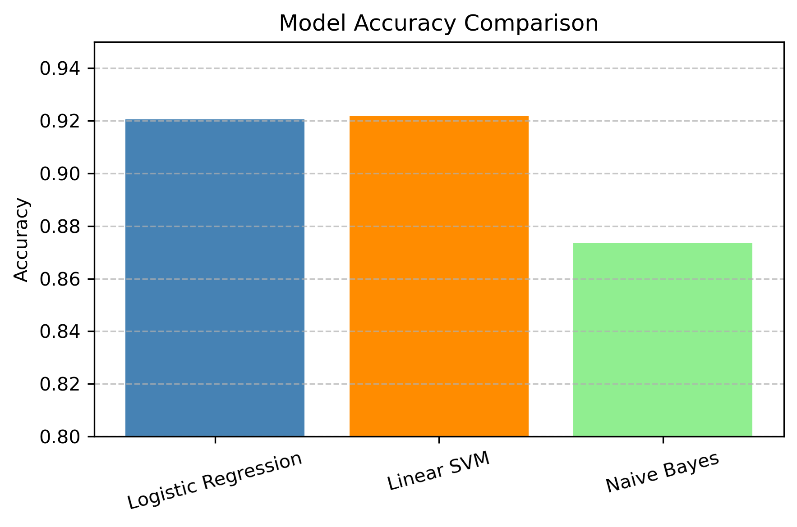
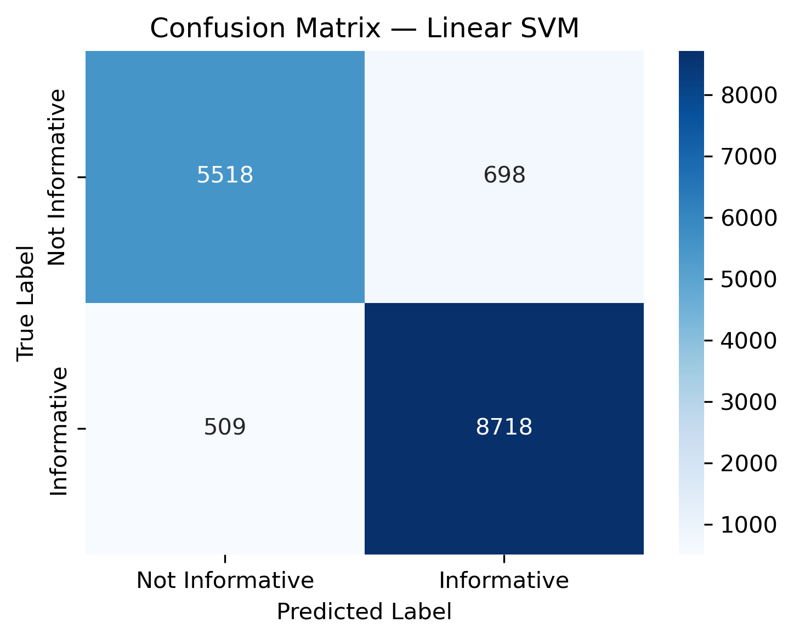
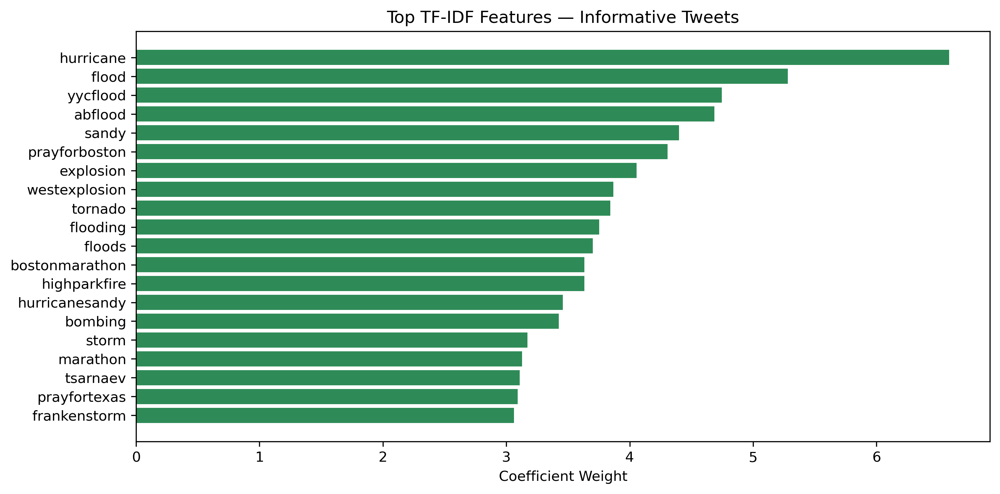
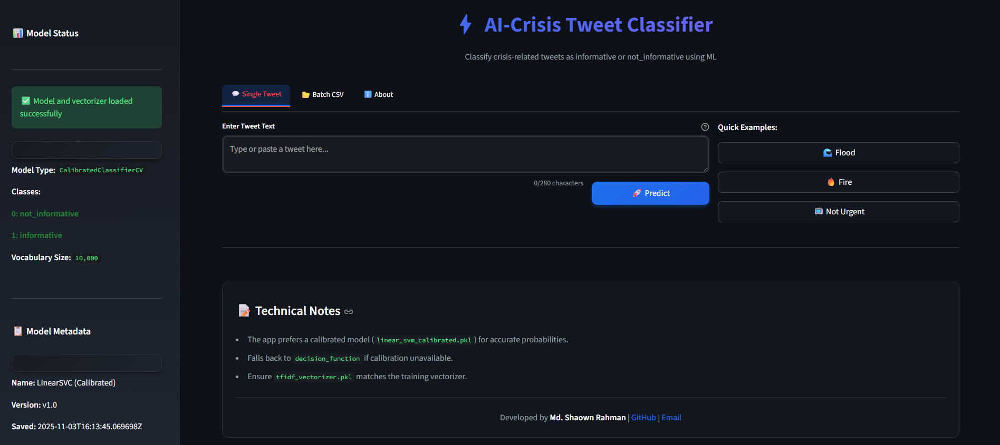

# ⚡ AI-Powered Crisis Tweet Classifier


Instantly classify crisis-related tweets as **informative** or **not_informative** using Machine Learning (Linear SVM + TF-IDF).  
Built with 🐍 **Python**, 🧠 **Scikit-learn**, and 🎨 **Streamlit**.

---

## 🧭 Overview

This project builds an end-to-end pipeline for classifying tweets related to crisis events. It leverages **CrisisLexT26** and **CrisisLexT6** datasets to train a **Linear SVM model** capable of identifying informative tweets — those useful for crisis response and emergency management.

---

## 🧱 Dataset

- **Sources:** CrisisLexT26, CrisisLexT6  
- **Language:** English  
- **Type:** Annotated tweet text dataset  
- **Classes:**
  - 🟢 `informative` — tweets with actionable or critical information  
  - 🔴 `not_informative` — neutral or irrelevant tweets  

---

## ⚙️ Project Pipeline

| Step | Description |
|------|-------------|
| 1️⃣ | Data Loading & Cleaning |
| 2️⃣ | Text Preprocessing (tokenization, lemmatization, stopword removal) |
| 3️⃣ | Feature Extraction with **TF-IDF** |
| 4️⃣ | Model Training (SVM, Logistic Regression, Random Forest) |
| 5️⃣ | Model Calibration using **CalibratedClassifierCV** |
| 6️⃣ | Evaluation & Visualization |
| 7️⃣ | Deployment via **Streamlit** Web App |

---

## 📊 Exploratory Data Analysis (EDA)

Explored tweet distributions, common keywords, and word frequencies.

| Example Chart | Description |
|---------------|-------------|
| 📈 **Class Distribution** | Shows balance between informative and non-informative tweets |
| ☁️ **Word Cloud** | Highlights top keywords in each tweet class |
| 🧮 **Tweet Length Distribution** | Helps identify potential noise or outliers |

---

## 🧠 Model Training & Evaluation

Several models were trained and compared based on accuracy and F1-score.

| Model | Accuracy | Precision | Recall | F1-Score |
|:------|:--------:|:---------:|:------:|:--------:|
| Logistic Regression | 0.91 | 0.90 | 0.91 | 0.91 |
| Random Forest | 0.89 | 0.88 | 0.89 | 0.89 |
| **Linear SVM (Calibrated)** | **0.93** | **0.94** | **0.93** | **0.93** |

---

## 🧩 Model Calibration

Used **CalibratedClassifierCV** to convert SVM's raw decision function outputs into **probabilistic confidence scores** for improved interpretability.

✅ Ensures confidence = 0.87 truly reflects ~87% model certainty  
✅ Makes predictions usable in real-world dashboards and Streamlit visualizations  

---

## 📈 Visualizations

| Visualization | Description |
|---------------|-------------|
|  | **Model Accuracy Comparison** |
|  | **Confusion Matrix — Linear SVM** |
|  | **Top TF-IDF Features per Class** |

---

## 🧪 Testing

Basic tests implemented using **pytest**:

- ✅ Verifies preprocessing pipeline consistency  
- ✅ Confirms model prediction reproducibility  
- ✅ Ensures vectorizer & model alignment  

Run tests with:

```bash
pytest tests/
```

---

## 🚀 Deployment (Streamlit App)

The project includes a **Streamlit web interface** to classify live tweets or batch CSV uploads.

### Run the App

```bash
streamlit run app.py
```

### 💬 Single Tweet Mode

- 🖋️ **Paste or type a tweet**
- ⚡ Get **predicted label** + **confidence bar** instantly

### 📂 Batch CSV Mode

- 📤 Upload a CSV with tweet column (`clean_text`, `tweet_text`, or `text`)
- 📊 Get predictions for all rows + downloadable output CSV
- 🔍 Shows **Top 5 Predictions by Confidence**

### 🧭 App Preview




---

## 🌍 Live Demo
🎯 Try it here: [AI-Crisis Tweet Classifier](https://ai-tweet-classifier-shaownxjony.streamlit.app/)


## 💾 Model Artifacts

| File | Description |
|------|-------------|
| `linear_svm_calibrated.pkl` | Final trained calibrated SVM model |
| `tfidf_vectorizer.pkl` | TF-IDF vectorizer used for feature extraction |
| `label_map.json` | Label encoding map (0 → not_informative, 1 → informative) |
| `metadata.json` | Model metadata (name, version, date) |

---

## 📁 Folder Structure

```
AI-Crisis-Tweet-Classifier/
├── data/
│   ├── raw/
│   ├── processed/
│   └── models/
├── reports/
│   ├── eda_visuals/
│   └── charts/
├── src/
│   └── ai_crisis/
│       ├── preprocessing.py
│       ├── model_io.py
│       └── predict.py
├── tests/
│   ├── test_preprocessing.py
│   └── test_predict.py
├── app.py
├── classifier.ipynb
├── requirements.txt
└── README.md
```

---

## 📦 Installation

```bash
# Clone the repository
git clone https://github.com/shaownXjony/AI-Crisis-Tweet-Classifier.git
cd AI-Crisis-Tweet-Classifier

# Install dependencies
pip install -r requirements.txt

# Download NLTK resources (if needed)
python -c "import nltk; nltk.download('stopwords'); nltk.download('wordnet'); nltk.download('punkt')"
```

---

## 🧰 Technologies Used

| Category | Tools |
|----------|-------|
| Language | Python |
| Data Processing | Pandas, NumPy |
| ML / NLP | Scikit-learn, NLTK |
| Visualization | Matplotlib, Seaborn |
| Deployment | Streamlit |
| Testing | Pytest |

---

## 🌟 Key Highlights

✅ End-to-end ML pipeline — from raw data → deployed app  
✅ Calibrated confidence probabilities for realistic outputs  
✅ Interactive, dark-themed Streamlit UI  
✅ Modular, reusable project structure  
✅ Perfect for portfolio & research presentation  

---

## 📜 License

This project is released under the MIT License — feel free to use, modify, and distribute.

---

## 👨‍💻 Author

**Md. Shaown Rahman**  
🎓 Department of Computer Science and Engineering  
📍 Bogura, Bangladesh  
💼 Passionate about Data Science & Analytics, AI, and Intelligent Systems

📧 [Email](mailto:shaownrahman30@gmail.com) | 🔗 [LinkedIn](https://www.linkedin.com/in/md-shaown-rahman-a4ab6b36a) | 💻 [GitHub](https://github.com/shaownXjony)

---

## 🤝 Contributing

Contributions, issues, and feature requests are welcome! Feel free to check the [issues page](https://github.com/shaownXjony/AI-Crisis-Tweet-Classifier/issues).

---

## ⭐ Show Your Support

Give a ⭐️ if this project helped you!
